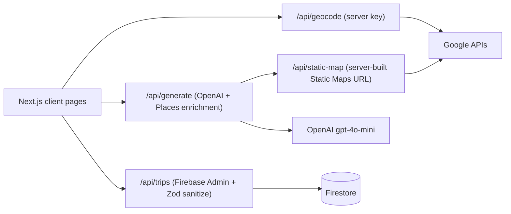

# Travel Planner

Travel Planner turns a destination, budget, and trip length into a realistic day-by-day itinerary with named places, food picks, maps, and an animated globe.

## Stack

- Next.js 16 App Router and TypeScript
- Firebase Auth and Firestore via Firebase Admin on server routes
- OpenAI `gpt-4o-mini` for itinerary generation
- Google Geocoding, Places, and Maps APIs
- React Three Fiber, GSAP, and tsparticles
- Tailwind CSS v4

## Setup

1. Install Node.js 20+.
2. Run `npm install`.
3. Copy `.env.example` to `.env.local` and fill in the OpenAI, Google, Firebase client, and Firebase Admin values.
4. Enable Google sign-in and Firestore in Firebase.
5. Deploy `firestore.rules` with the Firebase CLI.
6. Run `npm run dev` and open `http://localhost:3000`.

Firebase Admin credentials must remain server-only. Never prefix those values with `NEXT_PUBLIC_`.

## Scripts

- `npm run dev`: local development
- `npm run lint`: ESLint
- `npm run build`: production build
- `npm run start`: serve a production build
- `npm test`: unit tests (Vitest)

## Environment variables

Copy `.env.example` to `.env.local`. All values are validated at runtime by `src/lib/validateEnv.ts`.

| Variable | Required | Client / Server | Where to get it |
|---|---|---|---|
| `OPENAI_API_KEY` | Yes | Server | OpenAI dashboard |
| `GOOGLE_GEOCODING_API_KEY` | Yes | Server | Google Cloud Console (Geocoding API) |
| `GOOGLE_PLACES_API_KEY` | Yes | Server | Google Cloud Console (Places API) |
| `NEXT_PUBLIC_GOOGLE_MAPS_API_KEY` | No (maps degrade to placeholder) | Client | Google Cloud Console (Maps Static API). Restrict to Static Maps + HTTP referrers. Never used for secret calls — the browser only ever receives a server-built Static Maps URL from `/api/static-map`. |
| `NEXT_PUBLIC_GOOGLE_MAP_ID` | No | Client | Optional custom map style ID |
| `NEXT_PUBLIC_FIREBASE_*` (6 vars) | Yes | Client | Firebase Console → Project settings |
| `FIREBASE_CLIENT_EMAIL` | Yes | Server only | Firebase service account |
| `FIREBASE_PRIVATE_KEY` | Yes | Server only | Firebase service account (multiline). Never prefix with `NEXT_PUBLIC_` |
| `UPSTASH_REDIS_REST_URL` / `UPSTASH_REDIS_REST_TOKEN` | No (dev fail-open) / Yes in production | Server | Upstash Console. Without these, rate limiting logs a warning and allows requests — set them in production. |
| `NEXT_PUBLIC_APP_URL` | No | Client | Deployed origin (e.g. `https://my-app.vercel.app`) |

## Architecture

The home page owns trip form state and calls the server-side geocoding route. The loading route generates an itinerary and persists authenticated trips through `/api/trips`. Saved trip and list pages read from Firestore using verified Firebase ID tokens. Unauthenticated plans use a clearly marked local-storage fallback (`local_<timestamp>` keys, device-only, with a notice on the trip page).

Rate limits (Upstash Redis sliding window; fail-open with a warning when unconfigured): generation 5/hr anonymous, 20/hr authenticated; geocode 30/min anonymous, 120/min authenticated. Trip lists are capped at 50 (`limit(50)`). Static-map requests are clamped (200–1200px, max 20 markers).

## Troubleshooting

- **Map not loading / "No location data"**: check that `GOOGLE_PLACES_API_KEY` is set (enrichment flag `enriched: false` means coordinates were skipped) and that the Static Maps API is enabled for the server key.
- **Itinerary generation fails (400/502)**: verify `OPENAI_API_KEY` quota, request shape (`destination` 2–120 chars, `budget` 200–100000, `days` 1–14), and check server logs for "Itinerary generation error".
- **Sign in doesn't work**: check Firebase Auth authorized domains include your origin, and that all `NEXT_PUBLIC_FIREBASE_*` values match the Firebase project.
- **401 on `/api/trips`**: the request needs `Authorization: Bearer <Firebase ID token>`; `userId` must equal the token's `uid`; single-trip reads allow public trips without auth.
- **429 rate limit hit**: generation is 5/hr (anon) / 20/hr (signed in); geocode is 30/min (anon) / 120/min (signed in). `Retry-After` header gives seconds to wait; configure Upstash in production.
- **`FIREBASE_PRIVATE_KEY` errors**: keep literal `\n` newlines in the env value — the admin bootstrap converts them. Ensure no `NEXT_PUBLIC_` prefix on server-only keys.

## Deployment checklist (Vercel)

1. Add every `.env.local` value to Vercel project environment settings, including Firebase Admin credentials and Upstash tokens.
2. Set `NEXT_PUBLIC_APP_URL` to the deployed origin.
3. Restrict Google keys separately: server keys (Places/Geocoding/Static) by IP or "none + API restriction"; the client Maps key by HTTP referrer to your domain, Static Maps API only.
4. Deploy `firestore.rules` with the Firebase CLI (`firebase deploy --only firestore:rules`).
5. Add the deployed domain to Firebase Auth authorized domains.
6. Run `npm run lint`, `npm test`, and `npm run build` in CI before promoting.
